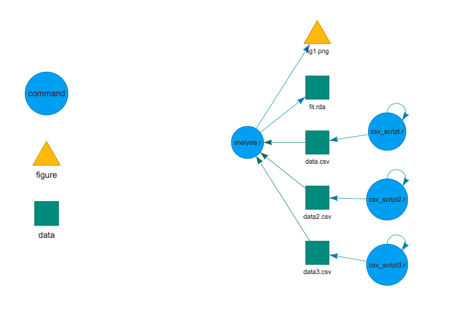

# File-based Make for R files

**DISCLAIMER**: This is an experimental repository to generate and visualize Makefile for R projects. It only supports specific conditions. Please be careful when you run `make` outside your test repository.

## Description

`makeR` requires GNU make and several R packages:

```{r, eval = F}
install.packages("tidyverse")
install.packages("stringr")
install.packages("visNetwork")
install.packages("processx")
```

## Example

```{r}
library(tidyverse)
library(stringr)
library(visNetwork)
library(processx)

# load functions to make a makefile
source("make_make.r")

# load functions to visualize a makefile
source("vis.r")

# make makefile based on files in the current repository
make_fun("Makefile")

# prepare data frame for visualization
plan <- make_dat_fun("Makefile")

# visualize makefile
vis_fun(plan)
```



To see the content of Makefile on your terminal:

```{bash}
cat Makefile

## .PHONY : all
## all : fig1.png fit.rda data.csv data2.csv data3.csv
##
## fig1.png: data.csv data2.csv data3.csv
##  Rscript analysis.r
##
## fit.rda: data.csv data2.csv data3.csv
##  Rscript analysis.r
##
## data.csv: csv_script.r
##  Rscript csv_script.r
##
## data2.csv: csv_script2.r
##  Rscript csv_script2.r
##
## data3.csv: csv_script3.r
##  Rscript csv_script3.rkk
```


To make your R project on your terminal:

```{bash}
make
```

To make your R project on your R console:
```{r}
run("make")
```
